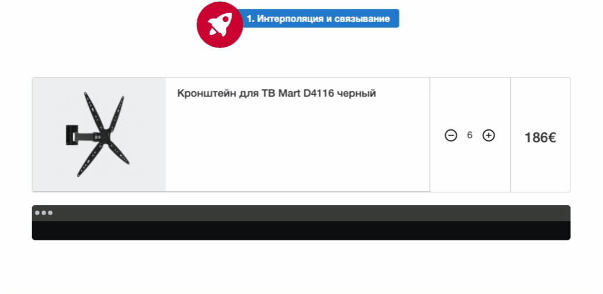

## Интерполяция, связывание данных и межкомпонентная коммуникация

В этом задании предлагаю сделать компонент карточку товара в корзине. Вывести данные о товаре в шаблоне.
Данные должны приходить из родительского компонента. А так же обработать событие изменения количества выбранного товара.
Данные события можно отобразить в родительском компоненте в терминале.
Для этого вам необходимо ознакомиться с документацией(README в папке модуля).
Также вы можете ознакомиться со скрин кастами по данной теме.



Не меняйте структуру html и стили компонетов

Для запуска окружения непрерывной разработки выполните команду

```bash
npm run start:1-components_1-shop-card
```

Для проверки своего решения выполните

```bash
npm run test:1-components_1-shop-card
```
