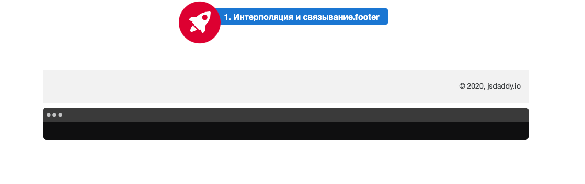

## Интерполяция, связывание данных и межкомпонентная коммуникация

В этом задании предлагаю сделать компонент footer. Информацию об авторе берем из файла environment.ts в папке environments. Продолжаем отрабатывать привязку данных, поэтому информация об авторе пробрасываем от родительского компонента к дочернему. Реализуйте функционал получения текущего года и отобразите его с помощью интерполяции.
Для этого вам необходимо ознакомиться с документацией(README в папке модуля).
Также вы можете ознакомиться со скринкастами по данной теме.



Не меняйте структуру html и стили компонетов

Для запуска окружения непрерывной разработки выполните команду

```bash
npm run start:1-components_2-footer
```

Для проверки своего решения выполните

```bash
npm run test:1-components_2-footer
```
